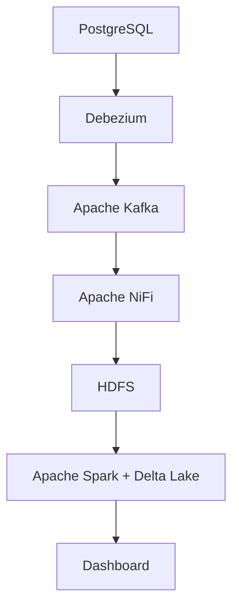

# Real-Time Data Pipeline: PostgreSQL → Debezium → Kafka → NiFi → HDFS → Spark (Delta Lake) → Dashboard

##  Overview

This project demonstrates a real-time data pipeline that captures Change Data Capture (CDC) events from PostgreSQL, streams them through Kafka, processes the data with Apache NiFi, stores it in HDFS, and performs analytics using Apache Spark with Delta Lake.

The pipeline ensures near real-time replication of data changes (insert, update, delete) and provides a robust foundation for building Data Lakehouse architectures.

---

## Technologies Used

* **PostgreSQL** – Source relational database.
* **Debezium** – Captures CDC events from PostgreSQL and streams them to Kafka.
* **Apache Kafka** – Distributed streaming platform for CDC events.
* **Apache NiFi** – Processes and routes data from Kafka to HDFS.
* **HDFS (Hadoop Distributed File System)** – Persistent storage for raw and processed data.
* **Apache Spark** – Data processing and analytics engine.
* **Delta Lake** – Enables ACID transactions, time travel, and schema enforcement on top of HDFS.
* **Docker & Docker Compose** – For containerized deployment of all components.

---

##  Architecture Diagram



---

## Pipeline Steps

1. **Debezium** monitors PostgreSQL and streams CDC events (insert, update, delete) to Kafka topics.
2. **Kafka** serves as a buffer for CDC events.
3. **Apache NiFi** consumes Kafka topics, transforms the data, and writes JSON records to HDFS.
4. **Apache Spark** reads raw data from HDFS, processes CDC events, applies deduplication and merges data into Delta Lake tables.
5. Delta Lake enables versioning and time travel for analytics and reporting.

---

##  How to Run

###  Clone the repository

```bash
git clone https://github.com/your-username/realtime-data-pipeline.git
cd realtime-data-pipeline
```

### Start the Docker environment

```bash
docker-compose -f debezium-kafka.yml up -d 
docker-compose -f hadoop-spark.yml up -d
docker-compose -f nifi.yml up -d
```

This will spin up:

* Debezium
* Kafka
* Zookeeper
* NiFi
* HDFS (NameNode & DataNode)
* Spark (Master & Worker nodes)

###  Import initial data to PostgreSQL

Run SQL scripts to populate the source database.

###  Verify Debezium CDC

Check Kafka topics for CDC events:

```bash
docker exec -it kafka kafka-console-consumer.sh --bootstrap-server kafka:9092 --topic dbserver1.public.books --from-beginning
```

###  Run Spark job

Execute the Spark job to process data and store results in Delta Lake:

```bash
spark-submit --packages io.delta:delta-core_2.12:2.4.0 last_CDC.py
```

---

##  Features

* Real-time CDC capture and processing.
* Handles INSERT, UPDATE, DELETE operations.
* Delta table using Spark.

---

##  Future Enhancements

* Integrate **Apache Superset** or **Metabase** for interactive dashboards.
* Add **Apache Airflow** for orchestration of pipeline jobs.
* Implement **Apache Atlas** for data lineage and governance.


---


## Author

[AmgadNady] ([https://www.linkedin.com/in/your-linkedin-profile/](https://www.linkedin.com/in/amgad0/))
